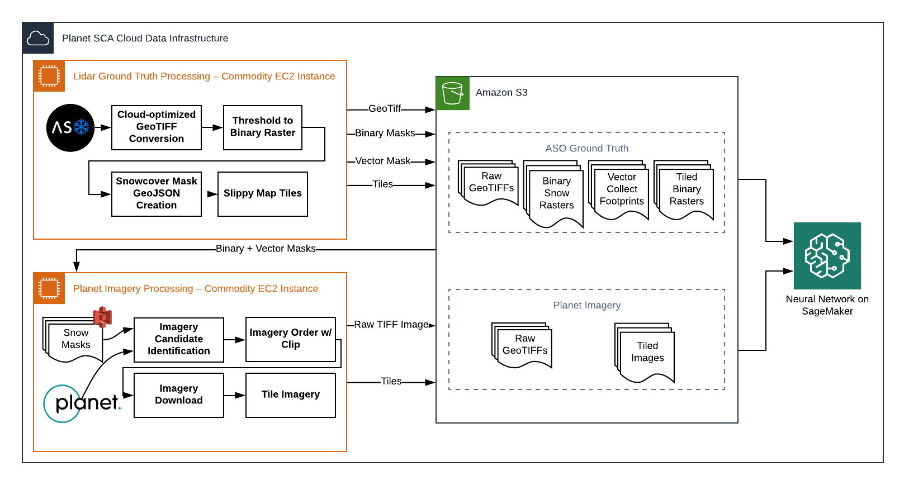

# `planet-snowcover` Pipeline Tutorial

**Tony Cannistra, 2019**

## About This Project
The goal of this project is to develop a set of tools which, with relative ease, allow a user with a set of ground-truth data to leverage the power of machine learning to classify their regions of interest in Planet Labs Imagery. In particular, these examples demonstrate how we've used NASA/JPL [Airborne Snow Observatory (ASO)](https://aso.jpl.nasa.gov) data as ground truth to train a neural network to identify snow in high resolution Planet Imagery.

### Planet Labs

[Planet Labs](https://www.planet.com/) is a company which provides 3 meter imagery of the entire planet (land surface) every day. This is accomplished via a constellation of hundreds of small satellites. Each satellite images the earth in 4 spectral bands: Red, Green, Blue, and Near Infrared. Researchers can gain access to these images via the [Planet Labs Education and Research Program](https://www.planet.com/markets/education-and-research/).

### Machine Learning

The low spectral bandwidth of this imagery, relative to larger government-sponsored satellites, means that tradional remote sensing classification approaches that rely on spectral indices (like NDVI and NDSI), work less well on Planet imagery. We leverage the state of the art in machine learning based image classification methods to bridge this gap.

## About This Document

This document details the processing pipeline we've developed to leverage Planet Labs imagery via a neural network and lidar-derived ground truth snow cover to create a high-resolution snow covered area mask. It consists of a set of Python notebooks, which implement the following set of tasks:

This pipeline is a combination of Jupyter notebooks, custom preprocessing code, open source command line tools, and Docker containers which run on Amazon Web Services infrastructure. While we've intended to make these notebooks as basic as possible, they require a basic understanding of AWS infrastructure (specifically EC2, S3, and Sagemaker). However, almost all of the code is infrastructure-agnostic.

## Table of Contents

1. Ground Truth Acquisition and Processing
2. Imagery Acquisition and Processing
2. Neural Network Configuration
3. Model Training and Evaluation
4. Snow Mask creation

## 1. Ground Truth Acquisition and Processing
**Notebook**: [`X_Acquire_ASO.ipynb`](X_Acquire_ASO.html)

The root of this image processing pipeline is the ground truth labeling, because it is the limiting factor to training the neural network. Put another way, we can't train the neural network on imagery for which we have no ground truth information, because the network has no foundation for its learning. As such, this pipeline begins with the identification, acqusition, and preprocessing of ground truth information.

For the snow-cover case, NASA/JPL Airborne Snow Observatory data serves as our ground truth. [`X_Acquire_ASO.ipynb`](X_Acquire_ASO.html) is the notebook which performs this part of the workflow.

## 2. Imagery Acquisition and Processing
**Notebook**:[`X_Planet_Ordering.ipynb`](X_Planet_Ordering.html)

The next step in the processing workflow is to use the spatial footprint of the ASO collect acquired in the previous step to acquire imagery from Planet Labs over the area specified in the footprint.

## 3. Neural Network Configuration

TBD

## 4. Model Training

## 5. Prediction and Snow Mask Creation
=======
# Pipeline Tutorials
*Tony Cannistra, with support from the [ESIP Lab](https://www.esipfed.org/lab) Incubator Program*

Planet Snowcover is a project which takes advantage of diverse tools and methods. These tutorials are designed to introduce these methods via an interactive set of steps. Through these tutorials, a user will engage with the entire process of setting up infrastructure, acquiring and processing data, training the ML model, and evaluating performance for this particular snowcover identification task.

Though you can run these tutorials on your local computer, the computational environment is sufficiently complex (and dependent on your local hardware!) that we've created an easy-to-use set of cloud infrastructure components that you can use to run through these tutorials. For information on how to deploy these resources, check out the [Deployment Guide](../deployment/README.md).

⚠️ **Note** *that GitHub Jupyter notebook rendering is often slow and buggy. If you're just viewing these notebooks on the web, you may have better luck viewing them with [NBViewer](https://nbviewer.jupyter.org).*

**Tutorial Contents**

1. [Airborne Snow Observatory Data Acquisition and Processing ](./1_Acquire_ASO.ipynb) (`1_Acquire_ASO.ipynb`, [NBViewer Link](https://nbviewer.jupyter.org/github/acannistra/planet-snowcover/blob/master/pipeline/1_Acquire_ASO.ipynb))
2. [Planet Labs Imagery Acquisition and Processing](./2_Planet_Ordering.ipynb) (`2_Planet_Ordering.ipynb`, [NBViewer Link](https://nbviewer.jupyter.org/github/acannistra/planet-snowcover/blob/master/pipeline/2_Planet_Ordering.ipynb))
3. ...

